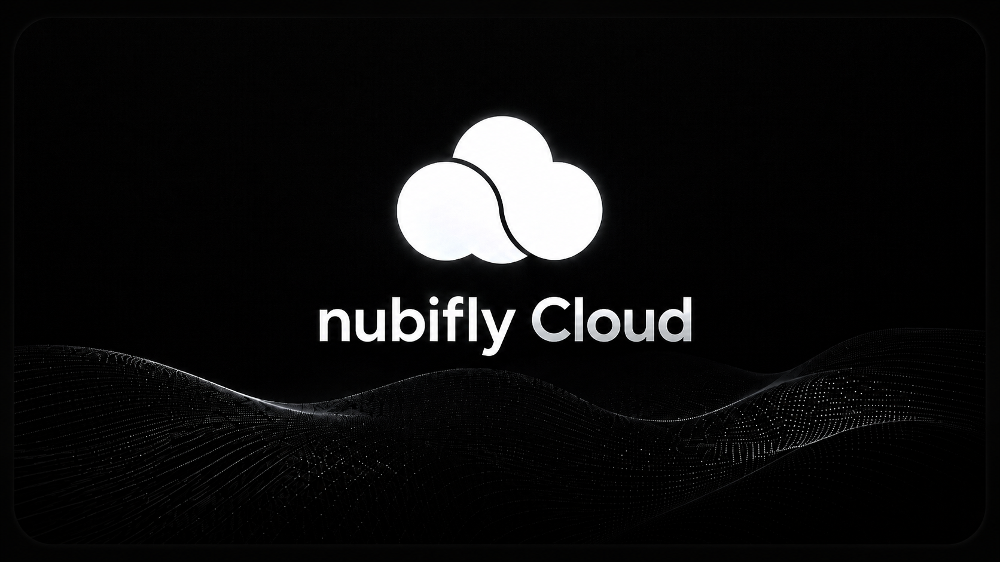

<p align="center">
  
</p>
<br>
<p align="center">
  
  
  
  
</p>

---

# Nubifly Cloud

Nubifly Cloud es una plataforma para almacenar y publicar archivos asociados a tus proyectos. Cada proyecto que creas obtiene su propio **`projectId`** y su propia **API key**, lo que te da control total sobre tus archivos, tus publicaciones y la información de tu proyecto.

Esta documentación describe únicamente las **funciones principales públicas** del sistema de archivos del proyecto y de las publicaciones recientes.

---

## Tabla de contenidos

- [Funciones principales](#funciones-principales)
- [Control del usuario sobre su proyecto](#control-del-usuario-sobre-su-proyecto)
- [Autorización](#autorización)
- [Endpoints públicos](#endpoints-públicos)
  - [1. Subir archivos a un proyecto](#1-subir-archivos-a-un-proyecto)
  - [2. Publicaciones recientes](#2-publicaciones-recientes)
- [Diferencia entre archivos del proyecto y publicaciones recientes](#diferencia-entre-archivos-del-proyecto-y-publicaciones-recientes)
- [Respuestas JSON esperadas](#respuestas-json-esperadas)
- [Ejemplos de uso](#ejemplos-de-uso)
- [Notas importantes](#notas-importantes)

---

## Funciones principales

Nubifly Cloud expone dos funciones públicas independientes para subir archivos:

| # | Función | Ruta | Identifica el proyecto por |
|---|---------|------|----------------------------|
| 1 | Subir archivos al sistema interno de un proyecto | `POST /api/v1/projects/:projectId/files/upload` | `projectId` en la URL + API key |
| 2 | Publicar archivos directamente en *Publicaciones recientes* | `POST /api/v1/publications/upload` | API key únicamente |

Ambas funciones reciben el archivo como **`multipart/form-data`** en el campo **`file`**.

---

## Control del usuario sobre su proyecto

Cuando creas un proyecto en Nubifly Cloud:

- Se genera automáticamente tu **`projectId`** — el identificador único de ese proyecto.
- Se genera tu propia **API key** — vinculada exclusivamente a ese proyecto.
- Tienes **control total** sobre los archivos, las publicaciones y la información del proyecto.

La **API key** sirve para autorizar publicaciones y las acciones permitidas.
El **`projectId`** sirve para identificar el proyecto correcto al subir archivos al sistema interno del proyecto.

> Cada proyecto genera su propia API key. Si rotas la API key, la anterior deja de funcionar inmediatamente.

---

## Autorización

Todas las funciones públicas usan el formato oficial:

```http
Authorization: Bearer TU_API_KEY
```

> **Importante:** este es el único formato aceptado por las nuevas rutas.
>
> - ❌ No se usa `x-api-key`
> - ❌ No se usa `apiKey` en query params
> - ❌ No se usa `Authentication` como header
> - ✅ El sistema oficial usa **`Authorization: Bearer TU_API_KEY`**

Si el header falta o tiene un formato diferente, la API responde con `401 API_KEY_MISSING`.

---

## Endpoints públicos

### 1. Subir archivos a un proyecto

Esta función pertenece al **sistema de archivos del proyecto**. Sirve para subir archivos dentro de un proyecto específico — los archivos quedan asociados al `projectId` y aparecen en el listado interno de archivos de ese proyecto.

```http
POST /api/v1/projects/:projectId/files/upload
Authorization: Bearer TU_API_KEY
Content-Type: multipart/form-data
```

| Parámetro | Lugar | Tipo | Requerido | Descripción |
|-----------|-------|------|:---------:|-------------|
| `projectId` | URL | string | ✅ | Identificador del proyecto al que se subirá el archivo. |
| `file` | form-data | archivo | ✅ | Archivo a subir (máximo 50 MB). |

**Requisitos**

- El usuario necesita su **`projectId`**.
- El usuario necesita su **API key** vinculada al proyecto.
- La API key debe corresponder al mismo `projectId` (o ser la API key del proyecto, o una API key de usuario con permisos `files:write` / `projects:write` sobre ese proyecto).

---

### 2. Publicaciones recientes

Esta función es **independiente del sistema interno de archivos del proyecto**. Sirve para publicar archivos sin necesidad de incluir el `projectId` en la URL: el archivo se asocia automáticamente al proyecto vinculado a la API key y alimenta la sección **"Publicaciones recientes"**.

Úsala cuando solo quieres publicar archivos de forma directa.

```http
POST /api/v1/publications/upload
Authorization: Bearer TU_API_KEY
Content-Type: multipart/form-data
```

| Parámetro | Lugar | Tipo | Requerido | Descripción |
|-----------|-------|------|:---------:|-------------|
| `file` | form-data | archivo | ✅ | Archivo a publicar (máximo 50 MB). |
| `title` | form-data | string | ❌ | Título de la publicación (máx. 120 caracteres). |
| `description` | form-data | string | ❌ | Descripción opcional (máx. 500 caracteres). |

**Requisitos**

- El usuario solo necesita su **API key**.
- No es necesario enviar `projectId` en la URL.
- La asociación con el proyecto se infiere desde la API key.

---

## Diferencia entre archivos del proyecto y publicaciones recientes

Es importante no confundir los dos sistemas. **No son lo mismo.**

| Característica | Archivos del proyecto | Publicaciones recientes |
|----------------|----------------------|-------------------------|
| Ruta | `POST /api/v1/projects/:projectId/files/upload` | `POST /api/v1/publications/upload` |
| Requiere `projectId` en la URL | ✅ Sí | ❌ No |
| Aparece en el listado interno de archivos del proyecto | ✅ Sí | ❌ No |
| Aparece en *Publicaciones recientes* | ❌ No | ✅ Sí |
| Tipo de uso | Gestión interna del proyecto | Publicación directa con la API key |

> **Regla rápida:**
> - ¿Necesitas que el archivo viva dentro del sistema de archivos del proyecto? → usa **(1) Archivos del proyecto**.
> - ¿Solo necesitas publicarlo? → usa **(2) Publicaciones recientes**.

---

## Respuestas JSON esperadas

### Subida correcta a un proyecto

`POST /api/v1/projects/:projectId/files/upload` → **`201 Created`**

```json
{
  "success": true,
  "message": "Archivo subido correctamente.",
  "data": {
    "file": {
      "fileId": "f0c1a2b3-1234-4abc-9def-0123456789ab",
      "fileName": "logo.png",
      "originalName": "logo.png",
      "mimeType": "image/png",
      "size": 24576,
      "fileSize": 24576,
      "url": "https://firebasestorage.googleapis.com/v0/b/.../o/uploads%2F.../logo.png?alt=media&token=...",
      "fileUrl": "https://firebasestorage.googleapis.com/v0/b/.../o/uploads%2F.../logo.png?alt=media&token=...",
      "projectId": "proj_abc123",
      "storagePath": "uploads/<ownerId>/proj_abc123/<timestamp>-logo.png",
      "status": "published",
      "createdAt": "2026-05-05T18:42:00.000Z"
    }
  }
}
```

### Publicación correcta

`POST /api/v1/publications/upload` → **`201 Created`**

```json
{
  "success": true,
  "message": "Publicación creada correctamente.",
  "data": {
    "publication": {
      "publicationId": "p1e2d3c4-5678-4abc-9def-0123456789ab",
      "fileName": "anuncio.pdf",
      "title": "Anuncio mensual",
      "description": "Resumen de mayo",
      "mimeType": "application/pdf",
      "size": 153298,
      "url": "https://firebasestorage.googleapis.com/v0/b/.../o/publications%2F.../anuncio.pdf?alt=media&token=...",
      "projectId": "proj_abc123",
      "status": "published",
      "createdAt": "2026-05-05T18:42:00.000Z"
    }
  }
}
```

### Error: falta autorización

→ **`401 Unauthorized`**

```json
{
  "success": false,
  "error": "API_KEY_MISSING",
  "message": "API Key requerida. Usa Authorization: Bearer TU_API_KEY."
}
```

### Error: API key inválida

→ **`401 Unauthorized`**

```json
{
  "success": false,
  "error": "API_KEY_INVALID",
  "message": "API Key inválida."
}
```

### Error: el archivo supera el tamaño máximo

→ **`413 Payload Too Large`**

```json
{
  "success": false,
  "error": "FILE_TOO_LARGE",
  "message": "El archivo supera el límite de 50 MB."
}
```

---

## Ejemplos de uso

### Subir un archivo a un proyecto — `cURL`

```bash
curl -X POST "https://nubifly.com/api/v1/projects/proj_abc123/files/upload" \
  -H "Authorization: Bearer TU_API_KEY" \
  -F "file=@/ruta/local/logo.png"
```

### Publicar un archivo en *Publicaciones recientes* — `cURL`

```bash
curl -X POST "https://nubifly.com/api/v1/publications/upload" \
  -H "Authorization: Bearer TU_API_KEY" \
  -F "file=@/ruta/local/anuncio.pdf" \
  -F "title=Anuncio mensual" \
  -F "description=Resumen de mayo"
```

### Subir un archivo a un proyecto — `JavaScript (fetch)`

```js
const form = new FormData();
form.append('file', fileInput.files[0]);

const res = await fetch(
  `https://nubifly.com/api/v1/projects/${projectId}/files/upload`,
  {
    method: 'POST',
    headers: { Authorization: 'Bearer TU_API_KEY' },
    body: form
  }
);
const data = await res.json();
console.log(data);
```

### Publicar un archivo — `JavaScript (fetch)`

```js
const form = new FormData();
form.append('file', fileInput.files[0]);
form.append('title', 'Anuncio mensual');
form.append('description', 'Resumen de mayo');

const res = await fetch('https://nubifly.com/api/v1/publications/upload', {
  method: 'POST',
  headers: { Authorization: 'Bearer TU_API_KEY' },
  body: form
});
const data = await res.json();
console.log(data);
```

---

## Notas importantes

- El **tamaño máximo por archivo** es de **50 MB**. Archivos más grandes se rechazan con `413 FILE_TOO_LARGE`.
- El campo `file` siempre se envía como **`multipart/form-data`**. No se aceptan cargas con `application/json` ni `base64`.
- **`projectId`** se envía únicamente en la URL del endpoint de archivos del proyecto. La ruta de publicaciones recientes **no** lo recibe en la URL.
- Cada proyecto tiene su **propia API key**. Si la rotas, la anterior deja de funcionar inmediatamente.
- El header oficial siempre es **`Authorization: Bearer TU_API_KEY`**. Cualquier otro formato será rechazado en estas rutas.
- Trata tu API key como un **secreto**: no la publiques en repositorios, código del lado del cliente expuesto, ni capturas de pantalla.

---

<p align="center">
  Hecho con ☁️ por <strong>Nubifly</strong> &nbsp;·&nbsp;
  <a href="https://nubifly.com">nubifly.com</a>
</p>
